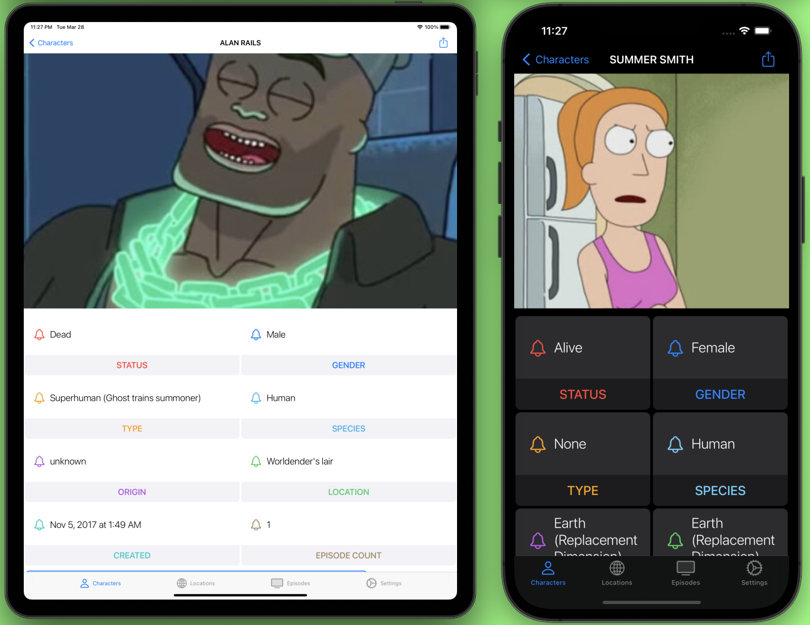
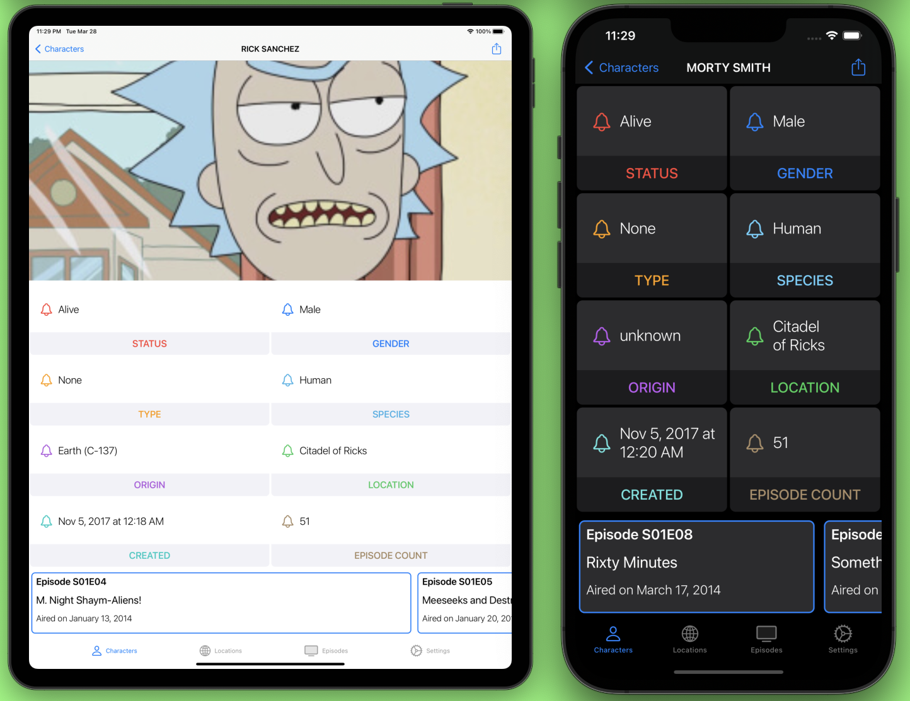
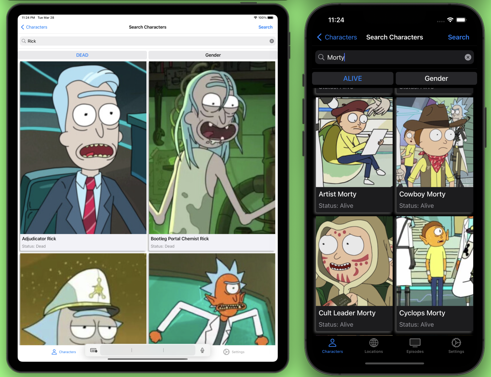
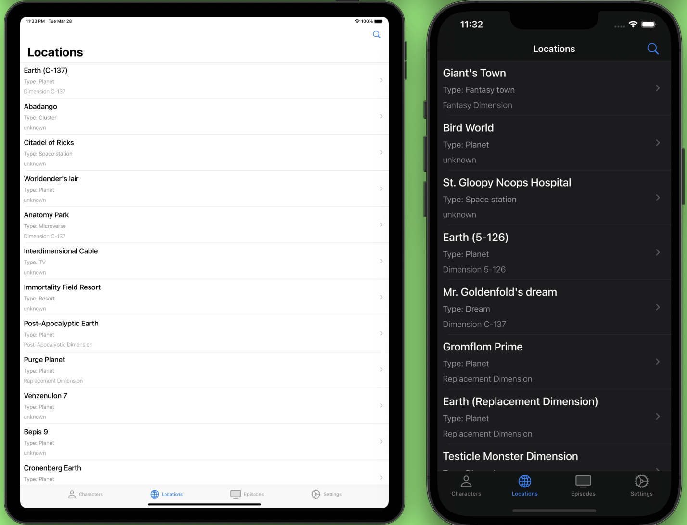
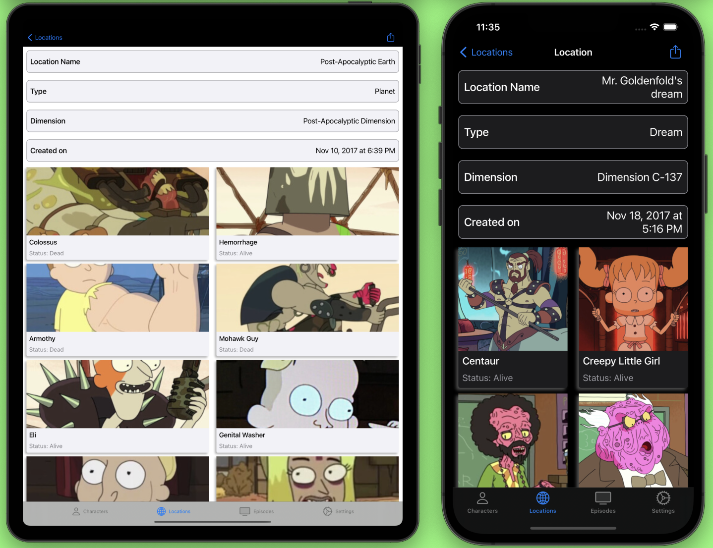
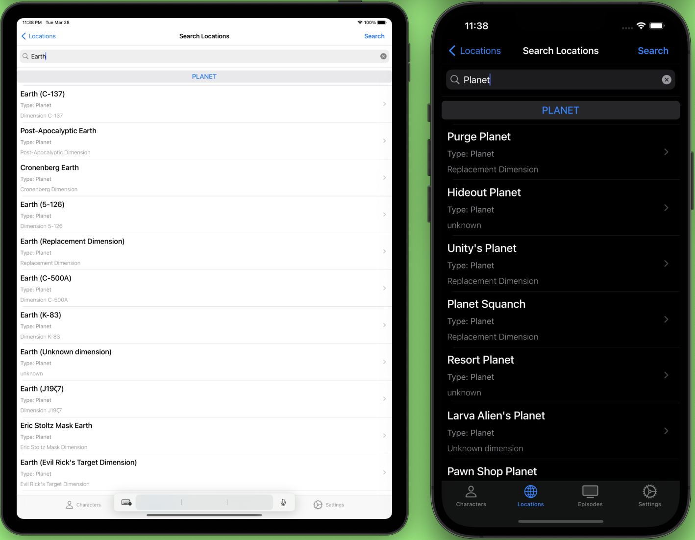
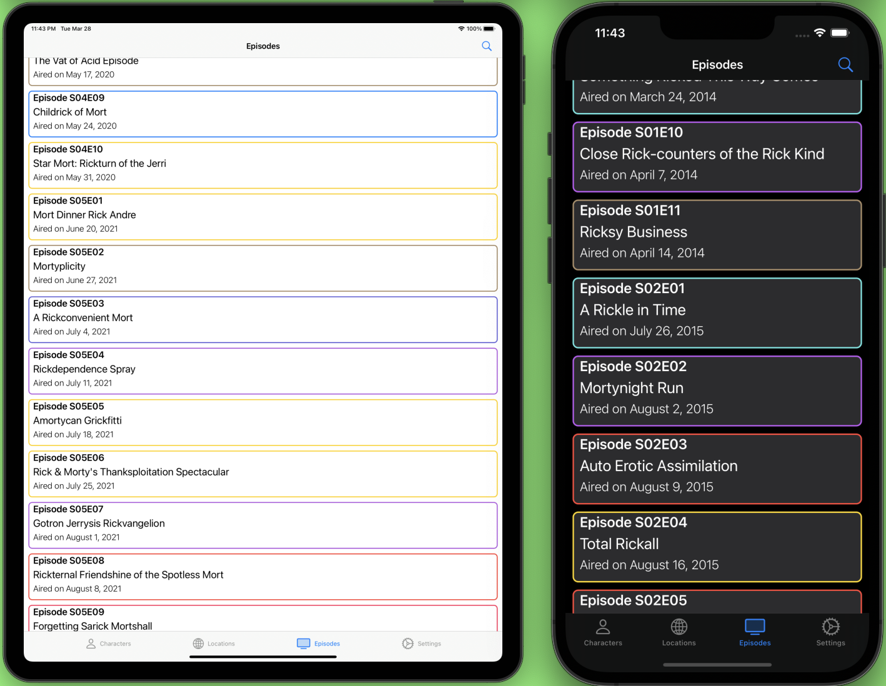
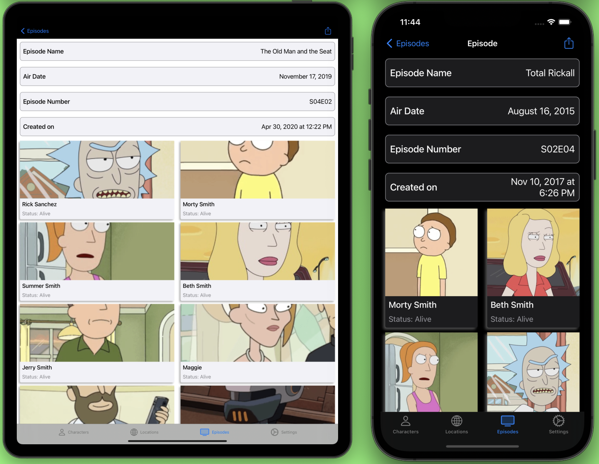
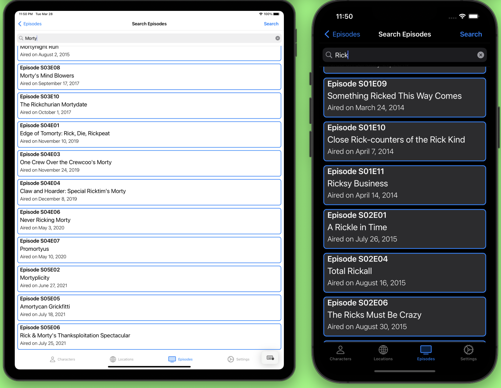

# Rick and Morty iOS App

## Full featured iOS app showcasing the Rick and Morty API

- Used Swift 5, UIKit, SwiftUI.

-  Used The Rick and Morty API (https://rickandmortyapi.com) to fetch all data.

-  The app showcases characters, episodes and locations of The Rick and Morty series.

- The API automatically paginate the responses. You will receive up to 20 documents per page.

- Optimized for both iPhone and iPad in both light and dark mode.

## Characters Tab

- There is a total of 826 characters.

### Show all characters

- You can access the list of characters using (https://rickandmortyapi.com/api/character).

- List of all characters from the API is shown in a UICollectionView (Grid View).

### Show a single character  

- You can get a single character by adding the id as parameter (https://rickandmortyapi.com/api/character/2).

- When you tap a character cell, you will get all details about a single character offered by the API.

- Leveraged UICompositionalLayout where each section is composed of groups of individual items. 

- It contains 3 sections that shows single character image, character details and the number of episodes in which the character appeared.

### Filter Characters

- You can also search for characters, just tap on the search icon in right navigation bar.

- For example, If you want to check how many alive Ricks exist, (https://rickandmortyapi.com/api/character/?name=rick&status=alive).

- You can search any character by name, status, gender.

## Locations Tab

- There is a total of 126 locations.

### Show all locations

- You can access the list of locations using (https://rickandmortyapi.com/api/location).

- List of all locations from the API is shown in a UITableView.

### Show a single location

- You can get a single location by adding the id as parameter (https://rickandmortyapi.com/api/location/3).

- Used UICollectionView to show each location details and show list of all characters from that location in a grid view.

### Filter locations

- You can also search for locations, just tap on the search icon in right navigation bar.

- You can search any location by name, type.

## Episodes Tab

- There is a total of 51 episodes.

### Show all episodes

- You can access the list of episodes using (https://rickandmortyapi.com/api/episode).

- List of all episodes from the API is shown in a UITableView.

### Show a single episode

- You can get a single episode by adding the id as parameter (https://rickandmortyapi.com/api/episode/28).

- Used UICollectionView to show each episode details and show list of all characters that appeared in that episode in a grid view.

### Filter episodes

- You can also search for episodes, just tap on the search icon in right navigation bar.

- You can search any episode by name.

# Note:

- There are still bugs and crashes that needs to be fix.

- Also, the character cells for character, location and episode detail view is not optimized for iPad screen yet.